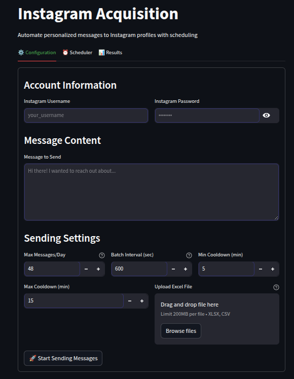
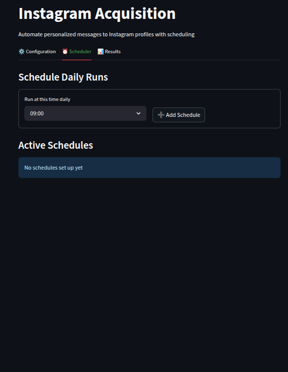
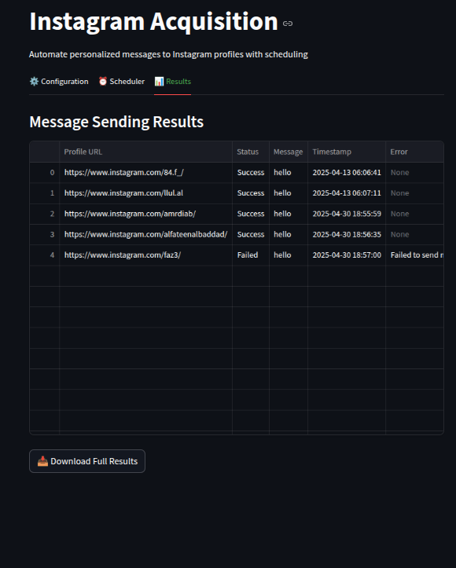
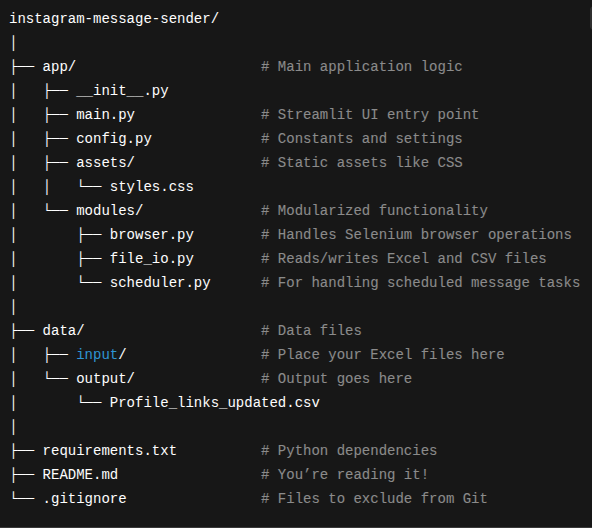

# 📸 Instagram Acquisition Tool

An automated tool built with Streamlit and Selenium that allows you to send Instagram messages in bulk with ease. 
Whether you are a marketer, influencer, or just want to automate personal outreach, this app provides a simple interface and automation behind the scenes.

## 🚀 Features

- ✅ Login securely to Instagram
- 💬 Compose and send custom messages
- 📊 Upload recipient lists via Excel/CSV
- 🕒 Set sending frequency, cooldowns, and daily limits
- ⏰ Schedule automated daily sending
- 📈 Track results and message status in real-time

---

## 🔧 Configuration Tab

Set up your messaging parameters and upload your recipient list file.

---

## 📆 Scheduler Tab

Choose a time of day when messages will be sent automatically.

---

## 📊 Results Tab

Track the status of each message (sent, failed, timestamped).

---

## 📁 Project Structure

